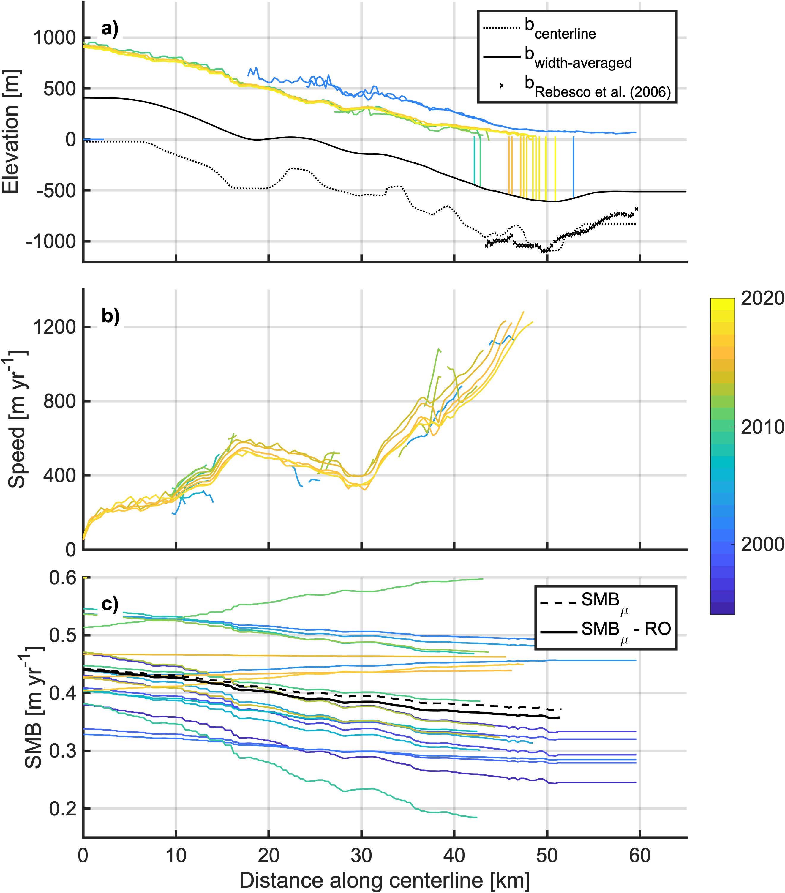
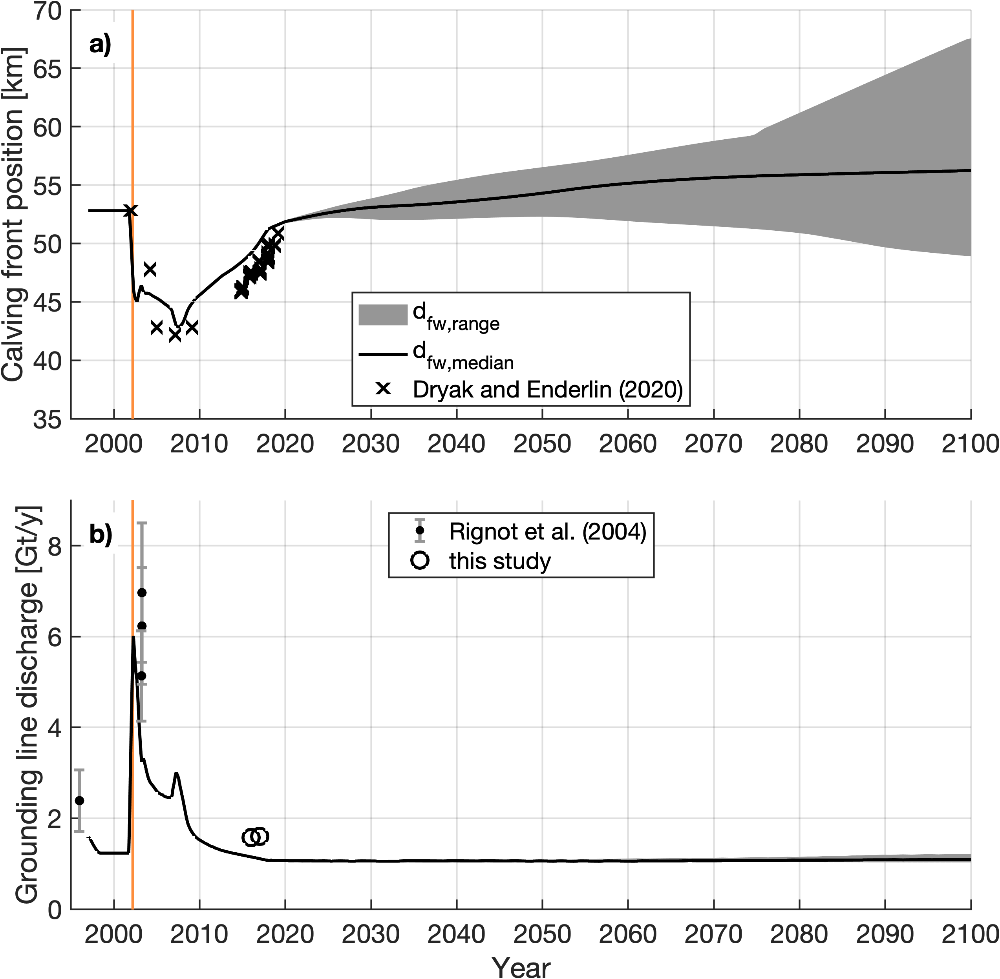
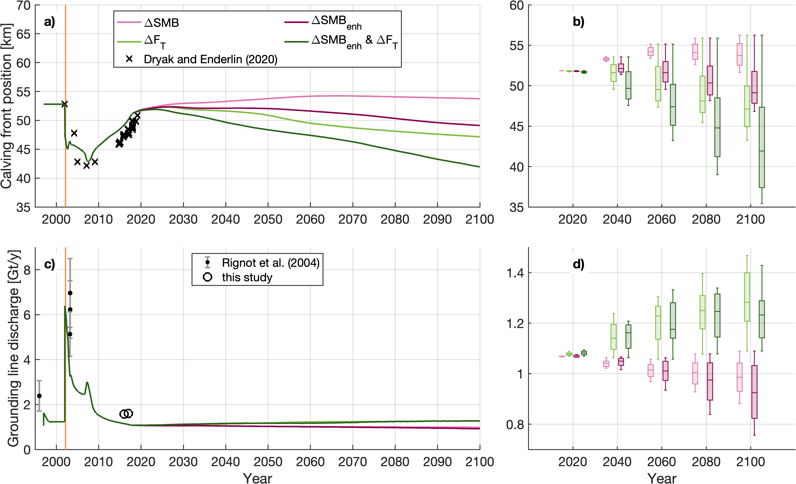

# Crane Glacier flowline modeling 

Code package used to model Crane Glacier response to the 2002 Larsen B ice shelf collapse and sensitivities to future changes in climate.

---

### Citation

Aberle R, Enderlin EM, Marshall H-P, Kopera M, Meehan TG (2023). Assessing controls on ice dynamics at Crane Glacier, Antarctic Peninsula, using a numerical ice flow model. _Journal of Glaciology_ __69__(277), 1109–1124. https://doi.org/10.1017/jog.2023.2

---
_Estimated conditions along the glacier centerline (1994-2018):_

_Modeling results under unchanging climate conditions with varying fresh water depth in crevasses (d_fw) and climate perturbations for surface mass balance (SMB) and ocean thermal forcing (F_T) (1994-2100):_

---

### Correspondence

Rainey Aberle (raineyaberle@u.boisestate.edu)

---

### Workflows:

- `steady-state-initial`: tune the model by simulating the pre-ice shelf collapse conditions until reaching a steady state criterion, the ice shelf collapse (remove all back stress), and run the model forward until 2100 with a range of future climate conditions.  
- `dynamic-initial-UNTESTED`: (not recommended) tune the model to produce post-collapse conditions 2009-2018, then run the model forward until 2100 with a range a future changes in climate conditions. 

### Order of operations:

- Synthesize observations and modeled conditions: `a_centerline_observations.m`, `b_glacier_width.mlx`, `c_downscale_RACMO.m`, `d_rate_factor.m`, `e_cumulative_strain.m`,  `f_LarsenC_melt.m`
- Save conditions to initialize model: `g_save_initialization.m`
- Run model simulations: `h_collapse_simulation.m`

### Extracted data:

To access observational data and model outputs averaged across the glacier width, see `inputs-outputs/`. 

- Centerline observations: all files with the `observed_*.mat` file name structure.
- Model outputs: all files with the `modeled_*.mat` file name structure. 
- Other:
    - `Crane_centerline.mat`: delineated glacier centerline coordinates (Antarctic polar stereographic)
    - `downscaled_RACMO_variables_2009-2019.mat`: RACMO2.3 model outputs for snowmelt, snowfall, runoff, and surface mass balance (SMB) interpolated to the glacier centerline and downscaled using statistical methods described by Noël et al. (2016)
    - `Tributary*.mat`: estimated mass flux from glacier tributaries to the main trunk
    
### Modeling results: 
See `workflows/steady-state-initial/results`.
- `1_SMB_DFW_TF`: results in model year 2100 for the range of SMB, freshwater depth in crevasses (DFW), and ocean thermal forcing (TF) perturbations applied independently.
- `2_SMB_enh`: results in model year 2100 for SMB plus surface meltwater runoff-enhanced submarine melt (SMB_enh).  
- `3_SMB_enh+TF`: results in model year 2100 for concurrent SMB_enh and TF perturbations. 

### Figures:

See `figures/` for figures used in manuscript and otherwise. 

---

### Datasets not included in this repository which are used in the workflow

Velocities:  

- NASA ITS\_LIVE (1999-2018) (Gardner et al., 2021): [NSIDC](https://nsidc.org/data/search)
- ERS-derived (1994-5) (Wuite et al., 2015): obtained through direct correspondence

Surface elevations:

- GTOPO30 (~1995) (Gesch et al., 1999): [NASA EarthData](https://search.earthdata.nasa.gov/search)
- ASTER DEMs (2000-2002): [NASA EarthData](https://search.earthdata.nasa.gov/search)
- NASA OIB L2 (2009-11, 2016-18) (Paden et al., 2010): [NSIDC](https://nsidc.org/data/search)

Terminus positions:

- Manually delineated from Landsat imagery (Dryak and Enderlin, 2020): [USGS EarthExplorer](https://earthexplorer.usgs.gov/)

Bed elevation: 

- NASA OIB L1B, manually digitized bed picks using the CReSIS toolbox (Paden et al., 2014): [NSIDC](https://nsidc.org/data/search)

Modeled climate conditions:

- RACMO v2.3 (Van Wessem et al., 2015; Lenaerts et al., 2018): obtained through direct correspondence with faculty and staff at Utrecht University

---

### References
Dryak, M. C., and Enderlin, E. M. (2020). Analysis of Antarctic Peninsula glacier frontal ablation rates with respect to iceberg melt-inferred variability in ocean conditions. _Journal of Glaciology_. _66_(257): 457-470. https://doi.org/10.1017/JOG.2020.21

Gardner, A. S., M. A. Fahnestock, and Scambos, T. A. (2021). MEaSUREs ITS_LIVE Landsat Image-Pair Glacier and Ice Sheet Surface Velocities: Version 1. https://doi.org/10.5067/IMR9D3PEI28U

Gesch, D. B., Verdin, K. L., and Greenlee, S. K. (1999). New land surface digital elevation model covers the Earth. _Eos Trans. AGU_. _80_(6), 69–70, https://doi.org/10.1029/99EO00050

Lenaerts, J., Ligtenberg, S., Medley, B., Van de Berg, W., Konrad, H., Nicolas, J., Van Wessem, J., Trusel, L., Mulvaney, R., Tuckwell, R., and others (2018). Climate and surface mass balance of coastal West Antarctica resolved by regional climate modelling. _59_(76pt1): 29-41. _Annals of Glaciology_. http://doi.org/10.1017/aog.2017.42

Paden, J., Li, J., Leuschen, C., Rodriguez-Morales, F. and Hale, R. (2010). Icebridge mcords l2 ice thickness, version 1. https://doi.org/63710.5067/GDQ0CUCVTE2Q

Paden, J., Li, J., Leuschen, C., Rodriguez-Morales, F. and Hale, R. (2014). Icebridge mcords l1b geolocated radar echo639strength profiles, version 2. https://doi.org/10.5067/90S1XZRBAX5N

Noël, B., Jan Van De Berg, W., MacHguth, H., Lhermitte, S., Howat, I., Fettweis, X. and Van Den Broeke, M.R. (2016). A daily, 1 km resolution data set of downscaled Greenland ice sheet surface mass balance (1958-2015). _10_(5), 2361–2377. _The Cryosphere._ https://doi.org/10.5194/tc-10-2361-2016

Van Wessem, J., Berg, V. D., Broeke, V. D., and Meijgaard, V. (2015). The modelled surface mass balance of the {Antarctic} {Peninsula} at 5.5 km horizontal resolution. _9_, 5097–5136. _The Cryosphere Discussions._ http://doi.org/10.5194/tcd-9-5097-2015

Wuite, J., Rott, H., Hetzenecker, M., Floricioiu, D., De Rydt, J., Gudmundsson, G. H., Nagler, T., and Kern, M. (2015). Evolution of surface velocities and ice discharge of Larsen B outlet glaciers from 1995 to 2013. _9_(3): 957-969. _The Cryosphere._ https://doi.org/10.5194/tc-9-957-2015

